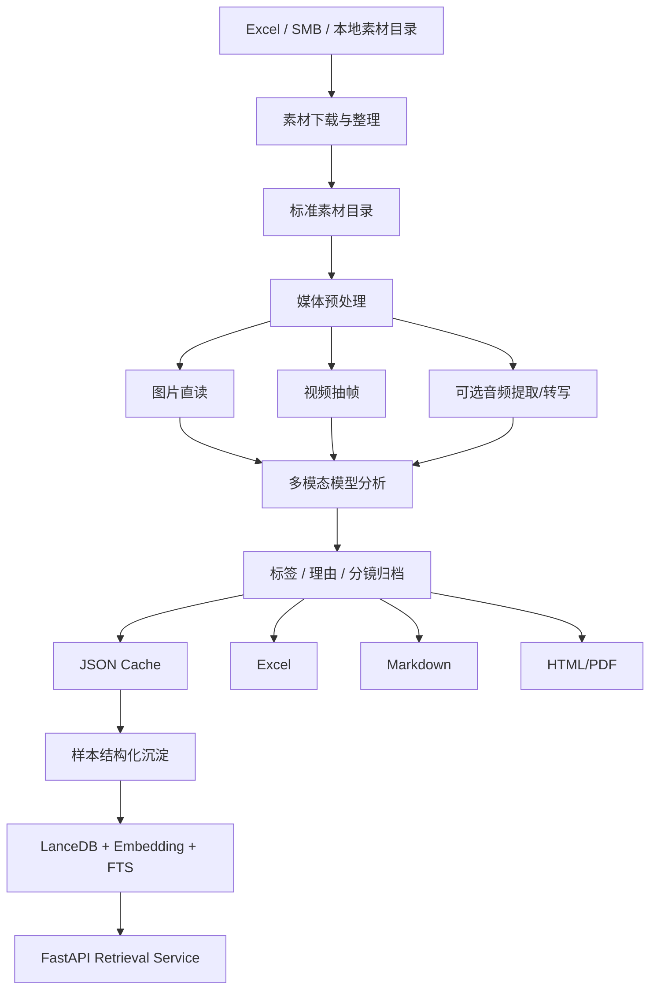
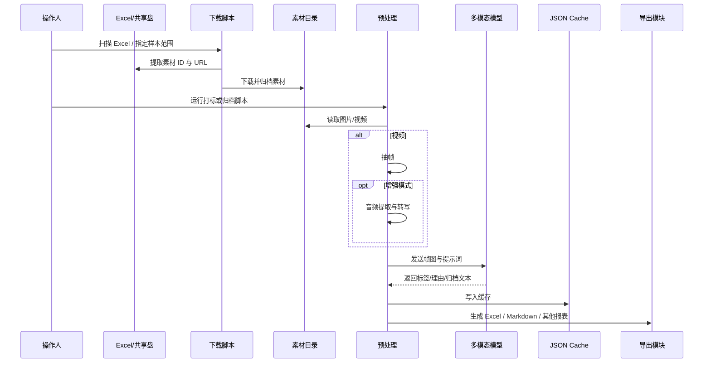
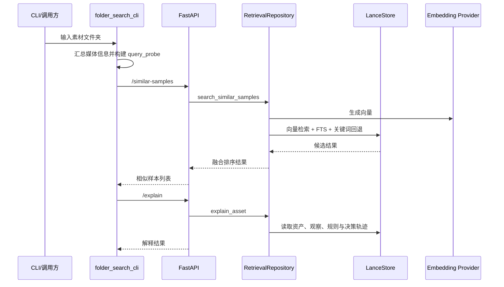

<p align="center">
  <h1 align="center">ai-content-realize</h1>
  <p align="center">
    <strong>面向电商内容素材的多模态打标、归档、导出与检索工具集</strong><br/>
    A production-oriented toolkit for multimodal labeling, archiving, exporting, and retrieval
  </p>
  <p align="center">
    
    
    
    
    
    
  </p>
</p>

---

## 目录

- [项目简介](#项目简介)
- [问题定义](#问题定义)
- [当前结论](#当前结论)
- [核心能力](#核心能力)
- [统一入口](#统一入口)
- [技术架构](#技术架构)
- [交互时序](#交互时序)
- [项目结构](#项目结构)
- [快速开始](#快速开始)
- [生产使用指南](#生产使用指南)
- [接口文档](#接口文档)
- [检索服务](#检索服务)
- [依赖与环境](#依赖与环境)
- [现状评估](#现状评估)
- [演进建议](#演进建议)
- [附录：关键文件](#附录关键文件)

---

## 项目简介

`ai-content-realize` 是一个围绕电商内容素材构建的多脚本生产工具集，核心目标不是做通用 AI Demo，而是解决一条真实的运营流水线：**把分散在 Excel、共享盘和素材文件夹中的图片 / 视频内容，转化为可打标、可归档、可导出、可检索的业务资产**。

项目当前已经形成两条主干能力：

1. **素材打标与归档链路**
   - 下载素材
   - 识别图片 / 视频
   - 视频抽帧
   - 可选音频提取与转写
   - 调用视觉模型输出标签、理由或分镜归档报告
   - 落缓存、导 Excel、导 Markdown、同步 SMB

2. **样本检索与规则解释链路**
   - 将历史打标结果整理为 observation / sample memory / rule card / decision trace
   - 用 LanceDB + Embedding + FTS 进行混合检索
   - 提供相似样本搜索、规则搜索、单素材解释接口

这个仓库的价值，不在于“形式上已经产品化完成”，而在于它已经把一条复杂的内容 AI 生产链路拆成了可执行的工程环节。

---

## 问题定义

这个项目试图解决的是一类典型的内容运营问题：

- 素材来源分散，常见入口是 Excel、SMB、共享盘、本地文件夹。
- 素材既包含图片，也包含视频，视频不能直接进入统一识别链路。
- 标签不是纯图像分类，而是带有业务规则的判定任务，例如：
  - 性能测评
  - 明星穿搭
  - 穿搭精选（核心 / 次要）
  - 单品展示（上脚）
  - 创意静物
  - 静物展示
- 运营不只需要标签，还需要“判定依据”和结构化结果文件。
- API 调用存在限流、过载、配额、长时任务中断等现实问题。
- 历史样本不能只停留在 Excel 里，需要沉淀为后续可检索、可解释的知识资产。

换句话说，这不是单点模型调用问题，而是一条完整的**多模态素材生产处理链**。

---

## 当前结论

基于代码现状，项目可以被准确理解为：

### 1. 这是一个“生产实践中使用的工具仓库”

它已经覆盖下载、打标、归档、导出、同步、检索多个环节，不是只会跑一两个脚本的实验目录。

### 2. 它已经隐含出合理架构，并完成了第一阶段工程收敛

从实现上已经形成：

- 接入层
- 分析层
- 沉淀层
- 服务层

当前仓库已经补齐：

- 统一依赖管理：`requirements.txt`、`pyproject.toml`
- 统一环境变量模板：`.env.example`
- 统一入口：`ai-content-realize`

但这些能力的内部实现仍主要建立在历史脚本之上，当前更准确的状态是“**入口已统一，内核仍待继续收敛**”。

### 3. 当前最可靠的主路径已经被收口到统一 CLI

| 主路径 | 目标 | 推荐命令 | 底层脚本 |
|------|------|------|
| 素材下载 | Excel -> 本地素材目录 | `ai-content-realize download` | `download_materials_improved.py` |
| 标签打标 | 产出标签 + 理由 + Excel | `ai-content-realize label` | `gemini_label_materials.py` |
| 内容归档 | 产出分镜 / 归档 Markdown 报告 | `ai-content-realize archive` | `gemma_dewu_archiver.py` |
| 缓存同步 | 监控 cache 并导出 / 同步 SMB | `ai-content-realize sync-cache` | `cache_sync_to_smb.py` |
| 依赖巡检 | 运行环境诊断 | `ai-content-realize doctor` | `check_multimodal_deps.py` |

### 4. 检索服务部分是平台化雏形，但不是单仓库自洽状态

`multimodal_label_service` 与 `multimodal_label_embedding` 设计完整度较高，但依赖仓库外模块，当前不能仅靠本仓库冷启动。

---

## 核心能力

### 1. 素材接入与标准化

通过 [download_materials_improved.py](/Users/kaori/Documents/ai-content-realize/download_materials_improved.py:1)：

- 自动扫描 Excel
- 识别 URL 列与素材 ID
- 将文件整理为 `downloaded_materials/<material_id>/`
- 支持重试、并发、断点续传

### 2. 图片 / 视频统一分析

通过 [extract_frames.py](/Users/kaori/Documents/ai-content-realize/extract_frames.py:1) 与各类打标脚本：

- 图片直接进入模型
- 视频先抽帧再分析
- 可选对视频做音频提取与 Whisper 转写

### 3. 多 provider 调度

当前代码中已经出现以下 provider 能力：

| Provider | 用途 | 主要脚本 |
|------|------|------|
| Gemini / YesCode 代理 | 标签打标 | `gemini_label_materials.py` |
| Custom MiniMax | 素材归档 | `gemma_dewu_archiver.py` |
| MiniMax / MiniMax MCP | 多模态分析 / 归档 | `gemma_dewu_archiver.py`、`minimax_mcp_multimodal_label_materials.py` |
| MINICPM | 视觉归档 | `gemma_dewu_archiver.py` |
| Kimi / Paddle | 归档扩展 | `gemma_dewu_archiver.py` |

### 4. 结果沉淀与导出

当前支持的结果形式包括：

- JSON cache
- Excel
- Markdown 报告
- HTML 对比报告
- PDF 报告

### 5. 共享盘同步

通过 [cache_sync_to_smb.py](/Users/kaori/Documents/ai-content-realize/cache_sync_to_smb.py:1)：

- 监控缓存变化
- 安全读取 JSON
- 导出 Excel
- 同步 SMB 共享盘

### 6. 相似样本检索与解释

通过 `multimodal_label_service/*`：

- 相似样本搜索
- 规则搜索
- 单素材 explain
- 服务不可用时的本地 fallback

---

## 统一入口

当前仓库已经提供统一生产入口：

```bash
ai-content-realize --help
```

这个统一入口的作用不是重写所有底层逻辑，而是先把生产接手最痛的两个问题收掉：

1. 安装方式不统一
2. 主脚本入口不统一

### CLI 命令概览

| 命令 | 作用 | 输入 | 主要输出 |
|------|------|------|------|
| `download` | 扫描本地 Excel 并下载素材 | `.xlsx/.xls` | `downloaded_materials/<material_id>/` |
| `label` | 使用 Gemini 进行标签打标 | 素材目录 | `gemini_label_cache.json`、Excel |
| `archive` | 使用多 provider 生成归档报告 | 素材目录 / SMB 挂载目录 | `*_report.md` |
| `sync-cache` | 监控缓存并导出 Excel / 同步 SMB | JSON cache | 本地 Excel、SMB 文件 |
| `doctor` | 检查关键依赖 | 当前环境 | 终端诊断结果 |

### 统一入口的现实边界

当前 CLI 是**编排层**，不是已经完成内核统一后的框架层。  
它解决的是“怎么装、怎么跑、从哪里进”的问题，但还没有完全解决“所有链路共享同一套内部配置、日志、错误模型”的问题。

因此，当前项目最准确的判断是：

- 外层入口已经统一
- 内部实现仍是历史脚本并存
- 这已经足以支撑生产交接
- 但还不是终态架构

---

## 技术架构

### 总体架构



### 分层设计

| 层级 | 职责 | 代表模块 |
|------|------|------|
| 接入层 | 从 Excel / 共享盘抽取素材并规范化目录 | `download_materials_improved.py` |
| 分析层 | 抽帧、转写、调用模型做判定或归档 | `gemini_label_materials.py`、`gemma_dewu_archiver.py`、`minimax_mcp_multimodal_label_materials.py` |
| 沉淀层 | 结果缓存、导出、同步、样本结构化 | `cache_sync_to_smb.py`、各类 export / compare 脚本 |
| 服务层 | 相似样本检索、规则检索、解释接口 | `multimodal_label_service/*` |

### 关键原理

#### 1. 视频先抽帧，再复用图片分析能力

这是当前仓库最核心的统一策略。好处是简单、稳定、兼容多 provider，代价是时序信息有损，因此动作类标签往往需要音频文本补偿。

#### 2. Cache 不只是提速，而是事实层

这里的 cache 承担四个角色：

- 防止重复调用模型
- 断点续跑
- 导出源数据
- 作为样本知识库回填原料

#### 3. 检索服务采用混合检索，而不是单一向量搜索

检索核心位于 [multimodal_label_service/retriever.py](/Users/kaori/Documents/ai-content-realize/multimodal_label_service/retriever.py:1)，采用：

- Embedding 检索
- FTS
- Keyword fallback
- RRF 融合排序

这保证了在 embedding 尚未完全准备好的情况下，系统仍具备可用性。

---

## 交互时序

### 素材打标链路



### 检索服务链路



---

## 项目结构

### 高价值目录 / 文件

```txt
ai-content-realize/
├── ai_content_realize_cli.py              # 统一 CLI 入口
├── pyproject.toml                         # 统一项目配置
├── requirements.txt                       # 统一依赖清单
├── .env.example                           # 环境变量模板
├── multimodal_label_embedding/            # Embedding provider 与渲染模板
├── multimodal_label_service/              # 检索服务与 CLI
├── download_materials_improved.py         # Excel -> 素材目录
├── extract_frames.py                      # 视频抽帧
├── gemini_label_materials.py              # Gemini 标签打标
├── gemma_dewu_archiver.py                 # 多 provider 素材归档主脚本
├── minimax_mcp_multimodal_label_materials.py # 增强型多模态打标
├── cache_sync_to_smb.py                   # 缓存导出与共享盘同步
└── 各类对比、导出、诊断、修复脚本
```

### 现状分层

| 类型 | 说明 |
|------|------|
| 主流程脚本 | 可直接支撑打标、归档、同步 |
| 服务脚本 | 提供检索与 explain 能力 |
| 运维辅助脚本 | 用于重试、恢复、监控、缓存修复 |
| 历史分析文档 | 记录问题排查和方案迭代过程 |
| 结果文件 | `.xlsx`、`.html`、`.log`、`.json` 等产出 |

---

## 快速开始

### 1. 安装基础依赖

当前仓库已提供统一依赖文件。推荐两种安装方式：

```bash
pip install -r requirements.txt
```

或作为本地工具安装：

```bash
pip install -e .
```

安装后即可直接使用：

```bash
ai-content-realize --help
```

### 2. 安装系统依赖

```bash
brew install ffmpeg
```

### 3. 准备环境变量

至少按实际使用链路准备：

```bash
cp .env.example .env
```

然后按实际 provider 填写 `.env`。

### 4. 准备素材目录

如果素材还在 Excel 中，先执行：

```bash
ai-content-realize download --sample 50
```

### 5. 跑最小标签任务

```bash
ai-content-realize label \
  --materials-dir downloaded_materials \
  --output-file gemini_labeled_results.xlsx \
  --delay 1 \
  --batch-size 5 \
  --batch-delay 20
```

### 6. 跑最小归档任务

```bash
ai-content-realize archive --media-type image --test
```

---

## 生产使用指南

### 统一入口

当前仓库已提供统一生产入口：

```bash
ai-content-realize --help
```

支持的主命令：

| 命令 | 作用 | 底层脚本 |
|------|------|------|
| `download` | 从本地 Excel 扫描并下载素材 | `download_materials_improved.py` |
| `label` | 使用 Gemini 进行标签打标 | `gemini_label_materials.py` |
| `archive` | 使用多 provider 生成归档报告 | `gemma_dewu_archiver.py` |
| `sync-cache` | 监控缓存并导出 / 同步 SMB | `cache_sync_to_smb.py` |
| `doctor` | 检查关键依赖 | `check_multimodal_deps.py` |

### 推荐生产入口顺序

```bash
ai-content-realize doctor
ai-content-realize download --sample 50
ai-content-realize label --materials-dir downloaded_materials
ai-content-realize archive --media-type image --test
ai-content-realize sync-cache --cache-file your_cache.json
```

### 方案 A：标签打标并导出 Excel

适用场景：需要稳定地输出“标签 + 理由 + Excel”。

```bash
ai-content-realize label \
  --materials-dir downloaded_materials \
  --output-file gemini_labeled_results.xlsx \
  --delay 1 \
  --batch-size 5 \
  --batch-delay 20
```

产物：

- `gemini_label_cache.json`
- `gemini_labeled_results.xlsx`

生产建议：

- 先小样本验证
- 保留 cache，不要反复清空
- 控制批次和批次间隔，避免代理或上游限流

### 方案 B：生成素材归档 Markdown 报告

适用场景：需要面向策划 / 运营输出结构化归档，而不只是标签。

```bash
ai-content-realize archive \
  --provider custom_minmax \
  --media-type image \
  --sample 100
```

或：

```bash
ai-content-realize archive \
  --provider minicpm \
  --media-type video \
  --sample 50
```

产物：

- `dewu_material_archives/*_report.md`
- 失败时对应 `*_error.txt`

生产建议：

- `--test` 先验连通性
- `concurrency` 保持较低
- 视频模式先确认 `ffmpeg` 可用
- 共享盘目录需提前挂载

### 方案 C：增强型多模态打标

适用场景：性能测评类素材需要依赖音频口播、解说信息辅助判断。

推荐脚本：[minimax_mcp_multimodal_label_materials.py](/Users/kaori/Documents/ai-content-realize/minimax_mcp_multimodal_label_materials.py:1)

特点：

- 视频抽帧
- 音频提取
- Whisper 转写
- 多模态融合

风险：

- 依赖链更长
- 外部模块要求更多
- 调试与成本都更高

### 方案 D：结果自动同步共享盘

```bash
ai-content-realize sync-cache
```

适用场景：

- 打标侧与结果消费侧分离
- 运营希望持续看到最新结果

---

## 接口文档

本次仓库已经新增独立接口文档：

- [PRODUCTION_INTERFACE_REFERENCE.md](/Users/kaori/Documents/ai-content-realize/PRODUCTION_INTERFACE_REFERENCE.md:1)

内容覆盖：

- CLI 命令接口
- HTTP 服务接口
- 环境变量接口
- 输入输出约定
- 错误边界与生产约束
- 项目现状评估、自我辨证与后续收敛建议

建议把 README 作为总览，把接口文档作为执行规范与交接依据。

---

## 检索服务

### 服务入口

- [multimodal_label_service/app.py](/Users/kaori/Documents/ai-content-realize/multimodal_label_service/app.py:1)
- [multimodal_label_service/retriever.py](/Users/kaori/Documents/ai-content-realize/multimodal_label_service/retriever.py:1)

### 当前接口

| 接口 | 作用 |
|------|------|
| `/healthz` | 存活检查 |
| `/readyz` | 就绪检查 |
| `/api/v1/search/similar-samples` | 相似样本搜索 |
| `/api/v1/search/rules` | 规则搜索 |
| `/api/v1/search/explain` | 单素材解释 |

### 启动方式

```bash
uvicorn multimodal_label_service.app:app --host 0.0.0.0 --port 8000
```

### 重要边界

这部分代码**不是单仓库自洽**，因为当前还依赖以下外部模块：

- `multimodal_label_store`
- `multimodal_label_eval`
- `multimodal_label_knowledge`
- `minimax_mcp_client`

因此，检索服务可以视为“平台化方向的核心雏形”，但不是当前仓库的即开即用部分。

---

## 依赖与环境

### Python 依赖

#### 统一安装文件

- [requirements.txt](/Users/kaori/Documents/ai-content-realize/requirements.txt:1)
- [pyproject.toml](/Users/kaori/Documents/ai-content-realize/pyproject.toml:1)
- [.env.example](/Users/kaori/Documents/ai-content-realize/.env.example:1)

#### 最小运行集

```txt
requests
pandas
openpyxl
Pillow
tqdm
opencv-python
python-dotenv
openai
httpx
fastapi
pydantic
numpy
```

#### 报表 / 文档相关

```txt
markdown
reportlab
matplotlib
```

#### 可选增强

```txt
sentence-transformers
fastembed
whisper
```

### 系统依赖

| 依赖 | 用途 |
|------|------|
| `ffmpeg` | 视频抽帧、音频提取 |
| SMB / 挂载目录 | 素材源与结果同步 |

### 环境变量现状

当前仓库仍存在部分历史命名分叉，这是已知问题：

- `MIN_MAX_API_KEY`
- `MINMAX_API_KEY`

后续建议统一为单一命名。

---

## 现状评估

### 项目优点

1. **业务闭环完整**
   - 已覆盖接入、分析、缓存、导出、同步、检索多个环节。

2. **生产问题感知强**
   - 能看到针对限流、超时、配额、重试、断点续跑、共享盘同步的现实补偿。

3. **平台化方向明确**
   - `retriever`、`embedding provider`、`rule search`、`explain` 都说明它不再只是临时脚本集合。

4. **第一阶段工程收敛已经完成**
   - 已有统一依赖文件
   - 已有统一环境模板
   - 已有统一 CLI 入口

### 当前缺口

1. **仓库不完全自洽**
   - 部分服务能力依赖外部模块

2. **统一入口已建立，但内部仍是脚本编排**
   - CLI 统一了解决“怎么进”
   - 但底层还没有统一成共享配置、共享日志、共享错误码的内核

3. **配置不统一**
   - 环境变量命名分裂
   - 路径配置仍有本地强绑定

4. **测试体系未成型**
   - 存在大量 `test_*.py`
   - 但主要是脚本式验证，不是 CI 可消费的自动化测试

### 当前判断

这个项目最准确的状态描述不是“未完成”，而是：

> **业务链路已经跑通，第一阶段工程外壳已经收敛，但内部实现仍处于“统一编排 + 历史脚本并存”的过渡态。**

---

## 演进建议

### 第一优先级

1. 将统一 CLI 进一步下沉为共享内核，而不是继续代理历史脚本
2. 建立统一日志模型和统一错误码
3. 区分 `production/` 与 `legacy/` 脚本
4. 为检索服务补齐缺失依赖说明或内嵌依赖包

### 第二优先级

1. 统一 cache schema
2. 统一标签枚举与字段命名
3. 统一输出目录结构
4. 统一 provider 适配层

### 第三优先级

1. 为检索服务补齐缺失依赖说明
2. 提供最小 demo 数据
3. 增加集成测试
4. 建立 CI

---

## 附录：关键文件

### 推荐先读

- [ai_content_realize_cli.py](/Users/kaori/Documents/ai-content-realize/ai_content_realize_cli.py:1)
- [pyproject.toml](/Users/kaori/Documents/ai-content-realize/pyproject.toml:1)
- [requirements.txt](/Users/kaori/Documents/ai-content-realize/requirements.txt:1)
- [.env.example](/Users/kaori/Documents/ai-content-realize/.env.example:1)
- [gemini_label_materials.py](/Users/kaori/Documents/ai-content-realize/gemini_label_materials.py:1)
- [gemma_dewu_archiver.py](/Users/kaori/Documents/ai-content-realize/gemma_dewu_archiver.py:1)
- [download_materials_improved.py](/Users/kaori/Documents/ai-content-realize/download_materials_improved.py:1)
- [cache_sync_to_smb.py](/Users/kaori/Documents/ai-content-realize/cache_sync_to_smb.py:1)
- [multimodal_label_service/app.py](/Users/kaori/Documents/ai-content-realize/multimodal_label_service/app.py:1)
- [multimodal_label_service/retriever.py](/Users/kaori/Documents/ai-content-realize/multimodal_label_service/retriever.py:1)

### 历史与分析材料

- `PRODUCTION_GUIDE_V3.md`
- `PRODUCTION_READY_ANALYSIS.md`
- `FINAL_SOLUTION.md`
- `PRODUCTION_LABELING_REPORT.md`
- 其他 `*_ANALYSIS.md`、`*_SUMMARY.md`

这些文件对理解问题演进有帮助，但不应替代本 README 作为当前入口文档。
